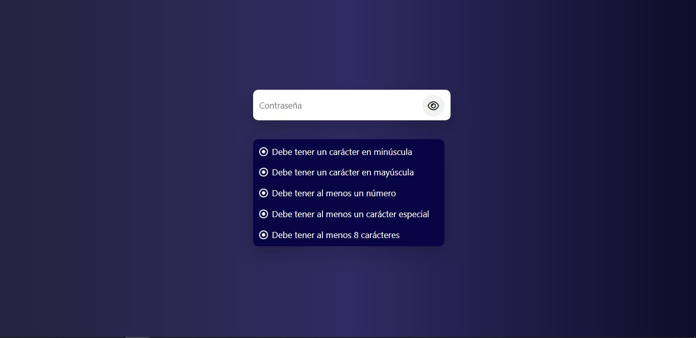

# Validación de contraseña

Este proyecto fue **desarrollado** con vanilla javascript

Su **funcionamiento** es sencillo simplemente se debe escribir una contraseña en el input que se muestra y la contraseña que se escriba debe cumplir todos los puntos mostrados en el recuadro.

---

Con este proyecto pongo a prueba **conocimientos** en:
- RegExp
- Eventos de teclado
- Validaciones de input 
- Maquetado HTML
- Estilos CSS
- Responsive Design

---

**Preview**

[Demo](https://dalemdev.github.io/validacion-de-contrasena/)

---

Desarrollado por **Dalemberg Garcia ♥** 